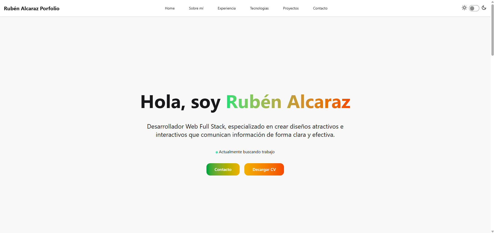

# Rubén Alcaraz – Portafolio Personal 🌟

¡Bienvenido a mi portafolio! Aquí comparto información sobre mí, mis habilidades, proyectos y cómo contactarme.

---

## 🔹 Sobre mí
Soy **Rubén Alcaraz**, desarrollador web en constante aprendizaje, apasionado por crear experiencias digitales intuitivas y visualmente atractivas.  
Me encanta explorar nuevas tecnologías y aplicarlas en proyectos personales y prácticos.  

---

## 🔹 Experiencia
Actualmente me dedico a **desarrollar proyectos web personales**, realizando buenas prácticas de desarrollo, diseño responsivo y UX/UI.

---

## 🔹 Tecnologías
Estas son algunas de las tecnologías que manejo:

---
## 🔹 Preview Portafolio

---
## 🔹 Proyectos Destacados

### 🌐 Proyecto Web: [Proyecto Comunidad]
- **Descripción:** Sitio web desarrollado para una comunidad de vecinos, con toda clase de interactividades, reserva de zonas comunes, visualizacion de noticas, etc...  
- **Tecnologías:** HTML, CSS, JavaScript, Bootstrap, PHP  
- **Demo / Enlace:** [https://github.com/rubenalcarazg/Proyecto-Comunidad](#)  

*(Pronto agregaré más proyectos a medida que avance en mi aprendizaje.)*

---

## 🔹 Contacto
📧 **Email:** rubenalcarazg04@gmail.com  
💼 **LinkedIn:** [www.linkedin.com/in/rubén-alcaraz-gadea](#)  
🐱 **GitHub:** [rubenalcarazg](https://github.com/rubenalcarazg)  

---

✨ ¡Gracias por visitar mi portafolio!  
Me encanta conectar con otros desarrolladores y aprender juntos.  